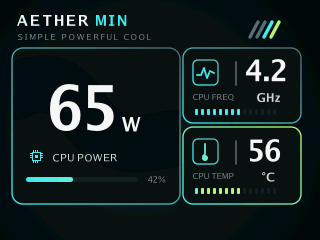
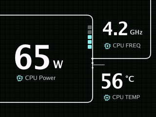
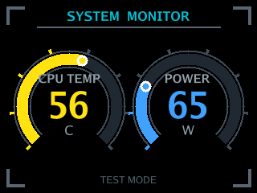
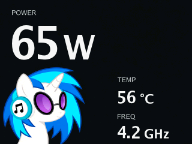
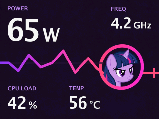
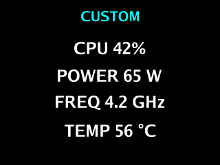

<div align="center">

# DeepCoolGo

**CPU monitoring on a DeepCool LCD cooler, with customizable themes written in Go.**

[](LICENSE)
[](go.mod)
[](#requirements)

English · [Русский](README.ru.md)

</div>

DeepCoolGo reads CPU load, temperature, frequency, and power consumption from
Linux system interfaces and displays them on a compatible DeepCool cooler's
320 × 240 LCD. It communicates with the display through `libusb` and loads the
screen layout from a Go plugin (`.so`).

## Contents

- [Features](#features)
- [Requirements](#requirements)
- [Quick start](#quick-start)
- [Configuration](#configuration)
- [Themes and previews](#themes)
- [Run as a service](#run-as-a-service)
- [How it works](#how-it-works)
- [Development](#development)
- [Troubleshooting](#troubleshooting)
- [Contributing](#contributing)
- [License](#license)

## Features

- CPU load (%), temperature (°C), frequency (GHz), and power consumption (W).
- Five ready-to-use themes and a template for creating your own.
- Software rendering with text, shapes, gauges, and alpha blending.
- Configurable sampling interval; frames are sent only when collected data changes.
- Direct USB communication and installation as a systemd service.

## Requirements

| Component | Requirement |
|---|---|
| Operating system | Linux; systemd is required for the service installation. |
| Display | A DeepCool 320 × 240 LCD with USB ID `3633:0026`. |
| Go | **1.26.6 or later**, as specified in [go.mod](go.mod). |
| Build tools | Git, Make, a C compiler, and `pkg-config`. The Makefile enables CGO. |
| Library | `libusb-1.0` and its development headers, required by `gousb`. |
| Access | Permission to access the USB device and read the metric sources below. The launch examples use `sudo`. |

Device detection currently accepts only USB ID `3633:0026` with a compatible
interface. If several compatible displays are connected, the application uses
the first one it can open, ordered by USB bus and address.

All of the following metric sources must be available and readable:

| Metric | Source |
|---|---|
| CPU load | `/proc/stat` |
| Temperature | `hwmon`: `k10temp` with the `Tctl` label, or `coretemp` with the `Package id 0` label |
| Frequency | `/sys/devices/system/cpu/cpu[0-9]*/cpufreq/scaling_cur_freq` |
| Power consumption | `/sys/class/powercap/intel-rapl:0/energy_uj` |

If any metric cannot be collected, the application logs a warning and skips
the entire screen update. There is currently no fallback for a missing power
counter or temperature sensor.

Install the build dependencies for your distribution:

```sh
# Fedora / Nobara
sudo dnf install git make golang gcc pkgconf-pkg-config libusbx-devel

# Debian / Ubuntu
sudo apt update
sudo apt install git make golang gcc pkg-config libusb-1.0-0-dev

# Arch Linux
sudo pacman -S --needed git make go gcc pkgconf libusb
```

Check `go version` against [go.mod](go.mod): your distribution's Go package may
be older than the required version.

## Quick start

```sh
git clone https://github.com/AlexanderBazarov/DeepCoolGo.git
cd DeepCoolGo

# Build the application and plugins, install themes for the current user,
# and create a configuration file if one does not exist.
make dev

# Use the same configuration directory when running with sudo.
sudo env XDG_CONFIG_HOME="${XDG_CONFIG_HOME:-$HOME/.config}" ./build/deepcoolgo
```

`make dev` copies plugins to `$XDG_CONFIG_HOME/DCGO/Themes`, using
`~/.config/DCGO/Themes` when `XDG_CONFIG_HOME` is unset. It creates a configuration
with the `aether.so` theme and a **5-second** sampling interval. Existing
configuration files are preserved; check `themes_path` if yours points elsewhere.

The explicit `XDG_CONFIG_HOME` in the launch command keeps the application using
your configuration when `sudo` changes the user environment. The first screen
update occurs after one sampling interval. Press `Ctrl+C` to stop.

To build without copying plugins or creating a configuration, run `make`.
For automatic startup, see [Run as a service](#run-as-a-service).

## Configuration

The application loads its configuration once, at startup:

| Launch context | Configuration file |
|---|---|
| Current user, `XDG_CONFIG_HOME` unset | `~/.config/DCGO/config.yml` |
| `XDG_CONFIG_HOME` set | `$XDG_CONFIG_HOME/DCGO/config.yml` |
| Installed systemd service | `/etc/deepcoolgo/DCGO/config.yml` |

If the file does not exist, the application creates it with default values.
This does not build or install theme plugins.

Example configuration for a service installed with `make install`:

```yaml
# Sampling interval in seconds; fractional values such as 0.5 are supported.
refresh_rate: 2

# Theme plugin file name within themes_path.
theme: aether.so

# Absolute path to the directory containing compiled plugins.
themes_path: /usr/local/lib/deepcoolgo/themes
```

| Key | Default in the application | Description |
|---|---|---|
| `refresh_rate` | `2` | Sampling interval in seconds; must be greater than zero. |
| `theme` | `aether.so` | Plugin file name, resolved relative to `themes_path`. |
| `themes_path` | `$HOME/.config/DCGO/Themes` | Plugin directory; the default is based on the process user's home directory. |

Use an absolute path for `themes_path`; `~` and environment variables are not
expanded in YAML values. The default plugin directory does not follow
`XDG_CONFIG_HOME`, but `make dev` explicitly writes the matching path when it
creates the configuration.

`make dev` uses a 5-second interval in a new configuration; `make install` and
the application defaults use 30 seconds. Restart the application or service
after changing any setting.

## Themes

These previews are rendered from the actual theme code at the display's native
resolution of 320 × 240. They use the same sample readings: **42% CPU load,
65 W, 56 °C, and 4.2 GHz**. Click an image to open the separate PNG file.

| Aether · `aether.so` | LM360 · `lm360.so` |
|:---:|:---:|
| [](docs/images/themes/aether.png) | [](docs/images/themes/lm360.png) |
| **Stats · `stats.so`** | **QuietBeat · `quietbeat.so`** |
| [](docs/images/themes/stats.png) | [](docs/images/themes/quietbeat.png) |
| **Twilight Signal · `twilight-signal.so`** | **Custom template · `custom.so`** |
| [](docs/images/themes/twilight-signal.png) | [](docs/images/themes/custom.png) |

Aether is the default theme. LM360 and QuietBeat show power, temperature, and
frequency, without CPU load. The Stats gauge limits are set in
[plugins/stats/main.go](plugins/stats/main.go). `custom.so` is a starting point
for your own theme.

`make plugins` builds all six plugins into `build/themes/`. To switch themes,
set `theme` to the plugin file name in `config.yml` and restart the application.
Plugins are loaded at startup; automatic reloading is not implemented.

Build the application and its plugins with the same Go version, compatible
build settings, and matching shared packages and dependencies. After changing
shared code or the toolchain, rebuild everything with `make clean && make`.
Run `make dev` or `sudo make install` again to update the installed copies.

See the [theme creation guide](themes/CREATING_THEMES.md) for the plugin
interface, drawing primitives, and examples of testing without a cooler.

## Run as a service

From the project root, install the application and enable automatic startup:

```sh
make
sudo make install
sudo make enable

systemctl status deepcoolgo
journalctl -u deepcoolgo -f
```

`make install` installs the application, plugins, systemd unit, and an initial
configuration. `make enable` reloads systemd and starts the service, enabling it
at boot. The supplied unit runs as root and restarts the process on failure.

| Default path | Contents |
|---|---|
| `/usr/local/bin/deepcoolgo` | Application executable |
| `/usr/local/lib/deepcoolgo/themes/*.so` | Theme plugins |
| `/usr/lib/systemd/system/deepcoolgo.service` | systemd unit |
| `/etc/deepcoolgo/DCGO/config.yml` | Service configuration, preserved on reinstall |

`PREFIX` defaults to `/usr/local`. The Makefile also supports `DESTDIR` for
staged installation and individual path overrides; see [Makefile](Makefile).

After changing the service configuration or reinstalling the application:

```sh
sudo systemctl restart deepcoolgo
```

To stop and disable the service, run `sudo make disable`. To remove the
installation while keeping its configuration, run `sudo make uninstall`.
Use the same path overrides as during installation.

### USB permissions

The launch examples and supplied service run the application as root to access
the USB device and metric sources. To run as a regular user, configure USB device
permissions (for example, through `udev`) and ensure that the same user can read
the metric sources, including the RAPL energy counter. USB permissions alone
may not be sufficient.

## How it works

1. [monitor/](monitor/) collects a `themes.CPUData` sample from Linux system interfaces.
2. The selected plugin's `Screen` function turns that sample into drawing objects.
3. [deep_cool/](deep_cool/) composites the objects into a 320 × 240 RGB565 frame.
4. [system/](system/) sends the frame header and pixel data over USB through `gousb`.

[app/runner.go](app/runner.go) repeats this cycle every `refresh_rate` seconds.
It skips rendering and transmission when the collected values match the last
successfully displayed sample.

## Development

Run commands from the project root:

```sh
make            # Build the application and all plugins
make build      # Build only build/deepcoolgo
make plugins    # Build only build/themes/*.so
make dev        # Build and install themes for the current user
make test       # Run go test ./...
go vet ./...    # Run static analysis
make clean      # Remove build artifacts
```

The [theme creation guide](themes/CREATING_THEMES.md) includes a PNG preview
example. To use it, create `cmd/preview/main.go` from the example and select
an existing theme, such as `themes.AetherTheme{}`, instead of the guide's
`NebulaTheme`. Then run `go run ./cmd/preview`. This lets you inspect the layout
without a connected cooler; the build still requires the dependencies above.

| Path | Purpose |
|---|---|
| [main.go](main.go) | Startup, dependency setup, and signal handling |
| [app/](app/) | Metric collection and display update loop |
| [config/](config/) | Configuration loading, defaults, and validation |
| [monitor/](monitor/) | CPU metric collection |
| [deep_cool/](deep_cool/) | Display detection, drawing primitives, and frame rendering |
| [system/](system/) | USB connection and data transfer |
| [themes/](themes/) | Theme interface, implementations, assets, and documentation |
| [plugins/](plugins/) | Entry points compiled into `.so` plugins |
| [packaging/](packaging/) | Service and configuration templates, RPM and nFPM packaging |
| [debian/](debian/) | Debian packaging files |

## Troubleshooting

| Symptom or log message | What to check |
|---|---|
| `compatible DeepCool displays not found` | Check the USB connection and device ID. Detection currently accepts `3633:0026` with a compatible interface. |
| `open compatible DeepCool display` | Check USB permissions and whether another process is using the display. |
| `load config` | Read the full error; check YAML syntax, file permissions, and `refresh_rate > 0`. The startup log reports the configuration path after a successful load. |
| `read theme plugin` | Check `themes_path` and the plugin file. Run `make dev` for a local setup, or reinstall plugins for the service. |
| `plugin was built with a different version of package ...` | Run `make clean && make` with consistent build settings, reinstall the application and plugins, and restart. |
| `collect metrics` / `read power` | The RAPL counter is missing or unreadable. The entire screen update is skipped. |
| `read cpu temperature` / `read cpu frequency` | Check the sensor and `cpufreq` sources listed under Requirements. These errors also prevent screen updates. |
| Power is `0` on the first sample | The first energy reading establishes a baseline for later power measurements. |
| The screen does not update | Wait one sampling interval and check the logs. Identical metric values do not trigger another frame. |

## Contributing

Issues and pull requests are welcome. Include your distribution, Go version,
USB device ID, and relevant logs when reporting a problem. For a new theme,
follow the [theme creation guide](themes/CREATING_THEMES.md).

Before submitting code changes, format the Go files and run `go vet ./...`,
`make test`, and `make`.

## License

[MIT](LICENSE) · Copyright © 2026 3x3cutable.
